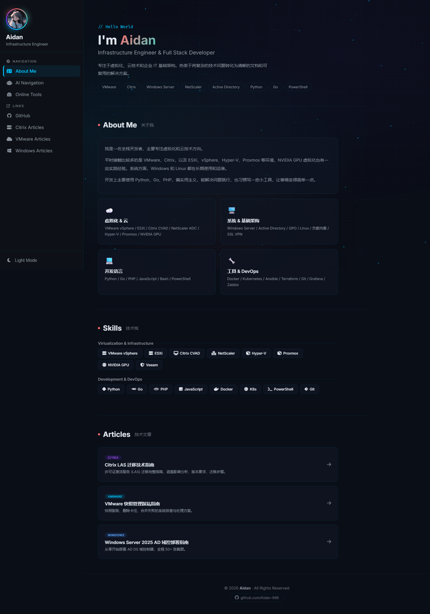
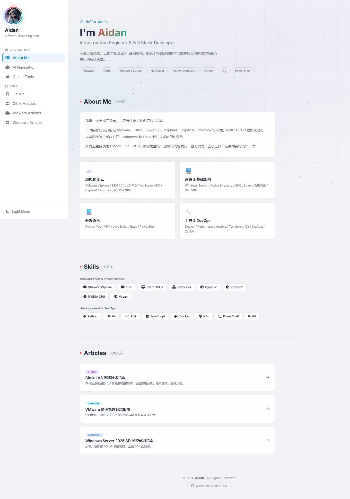
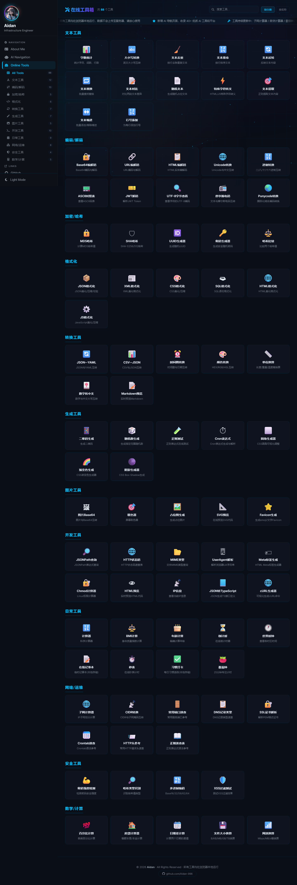
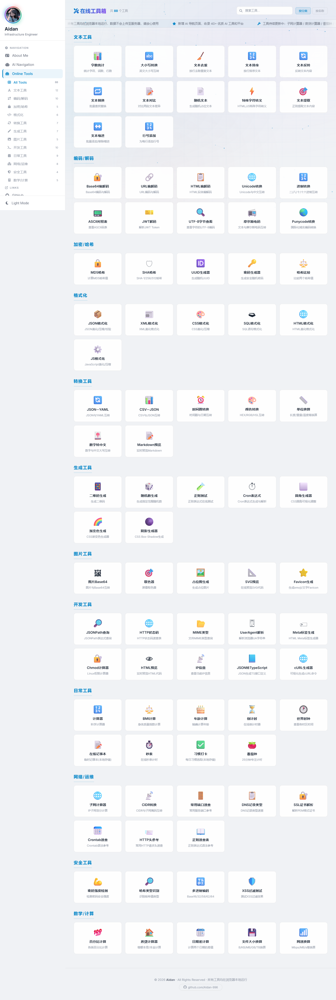
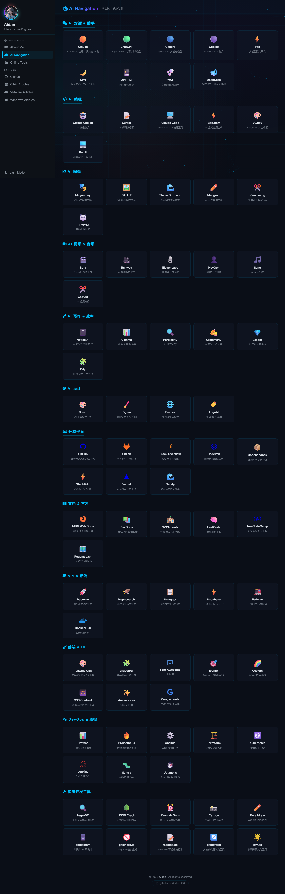
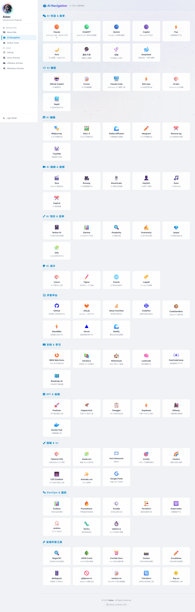

<div align="center">

[](https://git.io/typing-svg)


&nbsp;


</div>


&nbsp;

##  &nbsp;这是什么 | What is this

一个纯前端的在线工具箱，集合了 **88+ 实用工具** 和 **100+ AI & 开发者平台导航**，打开浏览器就能用。

日常工作中经常需要格式化 JSON、转换编码、算子网、生成密码、查端口号……每次都要去搜不同的网站。这个工具箱把这些常用工具整合到了一个页面里，同时收录了主流的 AI 平台和开发者常用网站，方便一站式查找。

**所有工具在浏览器本地运行，不上传任何数据。**

##  &nbsp;有什么功能 | What's inside

**三个页面，左侧导航切换：**

| 页面 | 内容 |
|------|------|
| **About Me** | 个人介绍、技术栈、技术文章链接 |
| **AI Navigation** | 100+ AI 和开发者网站导航（对话/编程/图像/视频/写作/设计/开发平台/API/前端/DevOps） |
| **Online Tools** | 88+ 在线工具，12 个分类，搜索 + 按分类/名称排序 |

&nbsp;

##  &nbsp;工具清单 | Tool List

**12 个分类，88 个工具：**

| 分类 | 包含工具 |
|------|---------|
| 文本工具 | 字数统计、大小写转换、去重、排序、反转、替换、对比、随机文本、转义、正则提取、缩进、行号 |
| 编码/解码 | Base64、URL、HTML、Unicode、进制转换、ASCII、JWT、UTF-8、摩尔斯电码、Punycode |
| 加密/哈希 | MD5、SHA、UUID、密码生成、哈希比较 |
| 格式化 | JSON、XML、CSS、SQL、HTML、JavaScript |
| 转换工具 | JSON/YAML、CSV/JSON、时间戳、颜色、单位换算、数字转中文、Markdown |
| 生成工具 | 二维码、随机数、正则测试、Cron、CSS 圆角/渐变/阴影 |
| 图片工具 | Base64 互转、取色器、占位图、SVG 预览、Favicon |
| 开发工具 | JSONPath、HTTP 状态码、MIME、UserAgent、Meta 标签、Chmod、HTML 预览、IP 信息、JSON 转 TS、cURL 生成 |
| 网络/运维 | 子网计算器、CIDR 转换、端口速查、DNS 记录、SSL 证书解析、Crontab、HTTP 头、正则速查 |
| 安全工具 | 密码强度检测、哈希类型识别、多进制编码、XSS 过滤测试 |
| 数学/计算 | 百分比、房贷计算器、日期差、文件大小换算、网速换算 |
| 日常工具 | 计算器、BMI、年龄、倒计时、世界时钟、记事本、秒表、习惯打卡、番茄钟 |

**AI & 开发者导航（100+ 站点）：**

| 分类 | 包含站点 |
|------|---------|
| AI 对话 | Claude、ChatGPT、Gemini、Copilot、Poe、Kimi、通义千问、豆包、DeepSeek |
| AI 编程 | GitHub Copilot、Cursor、Claude Code、Bolt.new、v0.dev、Replit |
| AI 图像 | Midjourney、DALL-E、Stable Diffusion、Ideogram、Remove.bg、TinyPNG |
| AI 视频/音频 | Sora、Runway、ElevenLabs、HeyGen、Suno、CapCut |
| AI 写作/效率 | Notion AI、Gamma、Perplexity、Grammarly、Jasper、Dify |
| AI 设计 | Canva、Figma、Framer、LogoAI |
| 开发平台 | GitHub、GitLab、Stack Overflow、CodePen、CodeSandbox、StackBlitz、Vercel、Netlify |
| 文档/学习 | MDN、DevDocs、W3Schools、LeetCode、freeCodeCamp、Roadmap.sh |
| API/后端 | Postman、Hoppscotch、Swagger、Supabase、Railway、Docker Hub |
| 前端/UI | Tailwind CSS、shadcn/ui、Font Awesome、Iconify、Coolors、CSS Gradient、Animate.css、Google Fonts |
| DevOps/监控 | Grafana、Prometheus、Ansible、Terraform、Kubernetes、Jenkins、Sentry、Uptime.is |
| 开发工具 | Regex101、JSON Crack、Crontab Guru、Carbon、Excalidraw、dbdiagram、gitignore.io、readme.so、Transform、Ray.so |

</td></tr></table>


&nbsp;

##  &nbsp;Screenshots | 界面截图

### About Me - Dark Mode



### About Me - Light Mode



### Online Tools - Dark Mode



### Online Tools - Light Mode



### AI Navigation - Dark Mode



### AI Navigation - Light Mode




&nbsp;

##  &nbsp;怎么用 | How to use

**方式一：直接下载**

1. 点击页面上方绿色 **Code** 按钮 → **Download ZIP**
2. 解压后双击 `index.html` 打开

**方式二：Git Clone**

```bash
git clone https://github.com/Aidan-996/Website-Tools.git
```

打开文件夹里的 `index.html` 就行。

> 不需要安装任何东西，不需要启动服务器，不需要联网（工具部分）。浏览器直接打开就能用。


&nbsp;

##  &nbsp;Contributing | 参与贡献

欢迎提交 Issue 和 Pull Request！详见 [CONTRIBUTING.md](CONTRIBUTING.md)

```
Fork → Clone → Branch → Commit → Push → Pull Request
```


&nbsp;

##  &nbsp;License | 版权声明

<table><tr><td>

- All tools run locally in the browser. No data is uploaded to any server.
- 所有工具均在浏览器本地运行，数据不会上传至任何服务器。

</td></tr></table>

<div align="center">

[](https://creativecommons.org/licenses/by-nc-sa/4.0/)

&nbsp;


</div>
